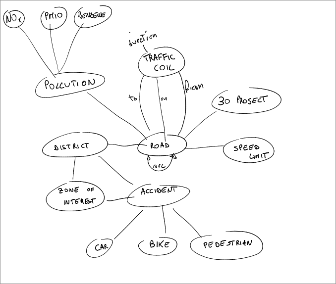

# BTP Group - Graph Databases

## Group members 

| NAME        | SURNAME     | EMAIL                                             | MATRICULE NUMBER |
|-------------|-------------|---------------------------------------------------| ---------------- | 
| Ali         | Bakhshayesh | ali.bakhshayesh@studenti.unipd.it                 |                  |
| Francesco   | Chemello    | francesco.chemello.1@studenti.unipd.it            |                  | 
| Marco       | Martini     | marco.martini.7@studenti.unipd.it                 | 2087642          | 

## Topic 

This Project focuses on the traffic flow using the datasets from the Bologna's [Open Data platform](https://opendata.comune.bologna.it/).

This dataset has been chosen in order to represent a real world scenario through a Graph Database.

This is particularly interesting since, while data analysis is available and already been done in the Open Data Platform, putting everything together in a simple to query database in order to infer more data through connected graphs is something we deemed useful for the community.

We deemed it especially important because we wanted to contribute to the "Città 30" Project [linked here](https://www.bolognacitta30.it/), and see wether or not the choice of the infrastructure changes aligns with the data we have and for a future work we will be able to import new data and compare the results to previous years easily. 

### Challenges and Characteristics

The main challenge is having to link everything together, for that we plan to use the "Archi Stradali" datasets that includes all the roads and street infrastructures, these are linked them through nodes, creating a graph on itself.

Despite this, linking everything is particularly tricky, since the data is not always directly correlated, but we're confident that due to the nature of a Graph Database we can easily connect different topics through other common grounds.

A few examples are the Traffic Accidents not providing the exact roads where they happen, instead they have "Zone di Prossimità" which are renowned neighborhoods and "Quartieri" which are City Districts. Luckily for us the Roads datasets include their district location. 

Another example would be the pollution sensors, which don't have a clear street location because of the way they encoded it, but by implementing a good parser we can link it to existing roads. 

We also had to consider which years to model as we don't always have the latest data for some tables (for example Accidents Data), and it can get very big in archiviation size very fast, which would be outside the scope of the project. It also has to be somewhat relevant to the "Città 30" Project so the data can't be too old either, for that we've chosen datasets from 2022.

The largest datasets are the Traffic control "Flusso Veicoli tramite spire" and Pollution "Dati centraline qualità dell'aria" as they provide daily data about it being around 300MiB and 100MiB respectively, the other datasets being roads and acccidents data are pretty small.

### Ontology idea

## Datasets Used ##

* [Incidenti stradali](https://opendata.comune.bologna.it/explore/dataset/incidenti_new/).
* [Progetti Citta 30](https://opendata.comune.bologna.it/explore/dataset/progetti-citta-30/).
* [Quartieri di Bologna](https://opendata.comune.bologna.it/explore/dataset/quartieri-di-bologna/).
* [Velocita Citta 30](https://opendata.comune.bologna.it/explore/dataset/velocita-citta-30/).
* [Archi Stradali (Roads)](https://opendata.comune.bologna.it/explore/dataset/rifter_arcstra_li/).
* [Rilevazione flusso veicoli tramite spire - anno 2022](https://opendata.comune.bologna.it/explore/dataset/rilevazione-flusso-veicoli-tramite-spire-anno-2022/).
* [Accuratezza flusso spire - 2022](https://opendata.comune.bologna.it/explore/dataset/accuratezza-spire-anno-2022).
* [Pollution 2017-2023](https://opendata.comune.bologna.it/explore/dataset/dati-centraline-bologna-storico/).
